# React Router v6 Action 実行タイミングと挙動

React Router v6 (Data Router) における `<Form>` 送信から画面更新までのフローをまとめます。

## 概要

React Router v6 の `createBrowserRouter` を使用した場合、`<Form>` による送信はブラウザのデフォルトの挙動（フルページリロード）ではなく、クライアントサイドルーティングとして処理されます。

主な流れは **Form送信 -> Action実行 -> Revalidation (Loader再実行) -> UI更新** です。

全体の流れを視覚化した図です。

```mermaid
graph TD
    A["<Form> Submit"] -->|navigation.state: 'submitting'| B(action)
    B --> C{"API Server (Mutation)"}
    C --> B
    B -->|return| D(Revalidation)
    D -->|navigation.state: 'loading'| E(loader)
    E --> F{"API Server (Query)"}
    F --> E
    E -->|return data| G("Component Re-render")
    G -->|navigation.state: 'idle'| H("UI Updated")

    subgraph "User Code"
        B
        E
    end

    subgraph "React Router"
        A
        D
        G
        H
    end
```



## 詳細フロー

以下は各ステップの詳細と、関係するライブラリやコードの動きを時系列で示します。

```mermaid
sequenceDiagram
    participant User as ユーザー
    participant Browser as ブラウザ
    participant RR_DOM as "react-router-dom<br>(&lt;Form&gt;)"
    participant RR_ROUTER as "@remix-run/router"
    participant Action as "User Code<br>(action関数)"
    participant Loader as "User Code<br>(loader関数)"
    participant React as React

    User->>Browser: 1. Submitボタンをクリック
    Browser->>RR_DOM: 2. onSubmit イベント発火
    RR_DOM->>RR_DOM: preventDefault() でリロードを阻止
    RR_DOM->>RR_ROUTER: 3. `navigate()` を呼び出し <br> `navigation.state` が `"submitting"` に
    RR_ROUTER->>Action: 4. マッチしたルートの `action` を実行
    Action->>Action: (例) APIへデータをPOST
    Action-->>RR_ROUTER: 5. `action` が完了し、結果を返す (例: null)
    Note right of RR_ROUTER: Revalidation (再検証) を開始 <br> `navigation.state` が `"loading"` に
    RR_ROUTER->>Loader: 6. アクティブな全ルートの `loader` を再実行
    Loader->>Loader: (例) APIから最新データをGET
    Loader-->>RR_ROUTER: loaderが完了し、データを返す
    RR_ROUTER->>React: 7. Routerのstateを更新 (loaderDataなど) <br> `navigation.state` が `"idle"` に戻る
    React->>React: 新しいデータでコンポーネントを再レンダリング
    React->>User: 更新されたUIを表示
```

### 1. Form Submit (Browser -> React Component)

ユーザーが `<Form method="post">` 内の submit ボタンを押下します。
ブラウザ標準の `submit` イベントが発生します。

### 2. イベント捕捉 (react-router-dom)

`react-router-dom` の `<Form>` コンポーネントが `onSubmit` イベントを捕捉します。
`event.preventDefault()` が呼ばれ、ブラウザのデフォルト動作（サーバーへのPOSTとリロード）がキャンセルされます。
内部的に `useSubmit` フック経由で Router インスタンスのナビゲーション処理が呼び出されます。

### 3. Navigation 開始 (@remix-run/router)

Router のコアロジックである `@remix-run/router` がナビゲーションを開始します (`router.navigate`)。
この時点で `navigation.state` が `"submitting"` になります。

### 4. Action 実行 (User Code)

Router はマッチするルート定義を探し、設定されている `action` 関数を実行します。

* **ファイル**: `src/page/project/id/CreateTodo.tsx` の `createTodoAction`
* **処理**: `request.formData()` でデータを取得し、API リクエスト (`apiFetch`) を行います。

### 5. Action 完了後の分岐 (@remix-run/router)

`action` 関数の返り値によって挙動が分岐します。

* **Redirect の場合** (`redirect('/path')` を返した場合):
  * Router は直ちに指定されたパスへのリダイレクト処理を開始します。
  * 新しいパスの Loader が実行されます。

* **データ/null の場合** (今回のケース):
  * Router は **Revalidation (再検証)** フェーズに入ります。
  * `navigation.state` は `"loading"` になります。

### 6. Revalidation / Loader 再実行 (User Code)

現在のページに表示されているすべてのアクティブなルートの `loader` 関数が並行して再実行されます。これにより、Action によって変更されたサーバー側の状態をクライアント側に反映させます。

* **ファイル**: `src/page/project/id/Project.tsx` の `projectLoader`
* **処理**: 更新された Todo リストを API から再取得します。

### 7. State 更新と再レンダリング (React)

Loader の実行が完了すると、Router の state が更新されます。

* `loaderData`: 新しいデータに更新
* `navigation.state`: `"idle"` に戻る
* `actionData`: Action の返り値がセットされる (もしあれば)

React の `RouterProvider` が新しい state を検知し、コンポーネントツリーを再レンダリングします。
`Project` コンポーネントは新しい `todos` データを受け取り、画面が更新されます。

## レイヤーとライブラリの役割

| 順序 | レイヤー | ライブラリ | 役割 |
| :--- | :--- | :--- | :--- |
| 1 | View | `react-router-dom` | `<Form>` コンポーネントによるイベントハンドリングと `preventDefault` |
| 2 | Core | `@remix-run/router` | ナビゲーションの状態管理、`action` 関数の呼び出し |
| 3 | App | User Code | `action` 関数による API コール (副作用の実行) |
| 4 | Core | `@remix-run/router` | Revalidation ロジック (どの Loader を再実行するか決定し実行) |
| 5 | App | User Code | `loader` 関数による最新データの取得 |
| 6 | View | `react` / `react-router-dom` | Context 更新による React コンポーネントの再レンダリング |

## 今回のコード (`CreateTodo.tsx`) における挙動

1. **Submit**: `CreateTodo` の `<button>` クリック。
1. **Action**: `createTodoAction` が実行され、`POST /projects/:id/todos` が叩かれる。
1. **Return**: `return null` が返される。
1. **Revalidation**: URL は変わらないため、現在のルート (`project/:projectId`) の `projectLoader` が再実行される。
1. **Fetch**: `GET /projects/:id/todos` が叩かれ、追加された Todo を含むリストが取得される。
1. **Render**: `Project` コンポーネントが再描画され、新しい Todo が一覧に表示される。
